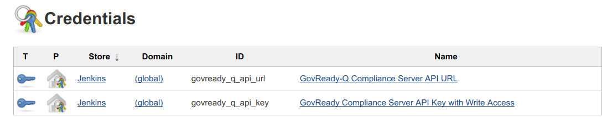
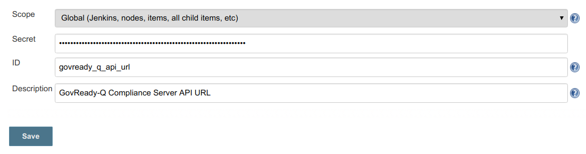

# continuous-ato-kit

## Start Jenkins

Start Jenkins running on the host machine on port 8080.

	docker run \
		--name jenkins --rm \
		-u root \
		-p 8080:8080 \
		-v jenkins-data:/var/jenkins_home -v /var/run/docker.sock:/var/run/docker.sock
		-v /path/to/host/dev/directory:/home \
		 jenkinsci/blueocean

Replace `/path/to/host/dev/directory` to the location on your host machine where your development files are.

## Start the Compliance Server

	./provision_compliance_server.sh

## Configure Jenkins

In Credentials, set two credentials --- `govready_q_api_url` and `govready_q_api_key` --- to the values outputted by the provision script. Go to the Credentials plugin:

Add two `Secret Text` credentials. The first looks like:

## Notes

* Port 8001 must not be blocked by a firewall. GovReady-Q Compliance Server will bind to port 8001 on the host and the Jenkins containers will attempt connect to it.