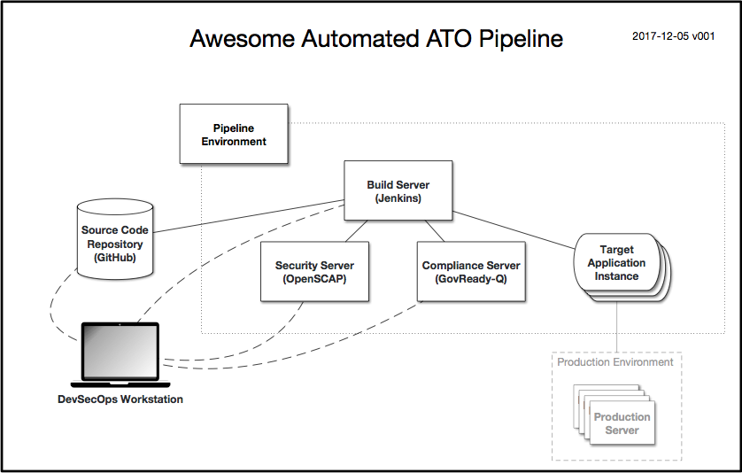

# Continuous ATO Kit

This repository contains an example for integrating federal cybersecurity compliance practices into an agile continuous integration/continuous deployment (CI/CD) pipeline.

In this example, we use Jenkins (a build pipeline), GovReady-Q (a compliance server), OpenSCAP (a security and testing server), a Target Application (a target app to build), and Docker (virtualization). This architecture could be adapted to other other choices of tool and other setups.

## Architecture

### Pipeline Servers

This pipeline example models seven common pipeline components:

* The **Application Source Code Repository**, such as a Github repository, containing the application being built. In this example we will build GovReady-Q.
* A **Docker Host Machine** running the Docker daemon, which could be your workstation.
* A **Build Server**, in this case Jenkins running in a Docker container on the host machine.
* A **Security and Monitoring Server** that calls OpenSCAP, in this case running in a Docker container on the host machine.
* A **Compliance Server**, in this case GovReady-Q running in a Docker container on the host machine. The Compliance Server provides an API for storing testing evidence and generates a system security plan.
* The **Target Application Server** to which the application is being deployed, in this case an ephemeral Docker container created during the build.
* The **DevSecOps Engineer’s (Your) Workstation**, which has a web browser that the engineer will use to access the Compliance Server to inspect compliance artifacts generated during the build. This workstation might be the same as the Docker Host Machine.

## Steps to Create the Pipeline

### Step 1: Get This Kit

Get the Continuous ATO Kit by cloning this repository onto the **Docker Host Machine**.

	git clone https://github.com/GovReady/continuous-ato-kit
	cd continuous-ato-kit

### Step 2: Set Up The Pipeline Environment

#### Install Docker and Docker Compose

First [install Docker](https://docs.docker.com/engine/installation/) on the **Docker Host Machine** (if on a Linux machine, you may want to [grant non-root users access to run Docker containers](https://docs.docker.com/engine/installation/linux/linux-postinstall/#manage-docker-as-a-non-root-user)).

On Mac and Windows, Docker Compose is included as part of those desktop installs. On Linux, [install Docker Compose](https://docs.docker.com/compose/install/#install-compose).

#### Start the Pipeline Environment

Use Docker Compose to start the **Build Server**, the **Security and Monitoring Server**, and the **Compliance Server**:

	docker-compose up

We’re running Docker Compose in the foreground so you can watch the terminal output. Leave that running and open a new terminal for the steps below.

Notes:

* See the [Jenkins documentation](https://jenkins.io/doc/tutorials/building-a-node-js-and-react-app-with-npm/) for further information about starting Jenkins.

* The **Security and Monitoring Server** is based on a CentOS 7 image. A Dockerfile in this repository builds the container's image and installs OpenSCAP.

* The **Security and Monitoring Server**, the **Compliance Server**, and the **Target Application Server** will communicate with each other using a Docker User Defined Network, which is a private virtual network.

#### Log into Jenkins

Check that Jenkins is now running at `http://localhost:8080/` on the **Docker Host Machine**. You should see a page named Unlock Jenkins. Get the automatically generated administrator password by running:

	./get-jenkins-password.sh

Paste it into the Unlock Jenkins form to log in. After logging in, choose “Install Suggested Packages”, then “Continue as Admin”, then “Start Using Jenkins”.

#### Log Into the GovReady-Q Compliance Server

The **Compliance Server** is a Docker container running GovReady-Q. In this section we set up GovReady-Q with a new user and begin a Compliance App. The Compliance App provides an API for storing testing evidence and generates a system security plan.

##### Workstation Networking Setup

Although the **Target Application Server** and the **Compliance Server** communicate through the Docker User Defined Network, the **DevSecOps Engineer’s Workstation** will connect to the **Compliance Server** via the **Docker Host Machine's** regular networking and Docker port forwarding. The Compliance Server is listening on port `8000` on the **Docker Host Machine**.

Add an alias in the `/etc/hosts` file on the **DevSecOps Engineer’s Workstation** for `govready-q` so that the Compliance Server can be reached easily. If the **DevSecOps Engineer’s Workstation** is the same machine as the **Docker Host Machine**, use the loopback address:

	127.0.0.1	govready-q

If the machines are different, use the IP address of the **Docker Host Machine**.

##### Set Up GovReady-Q

Now open the GovReady-Q Compliance Server in a web browser on the **DevSecOps Engineer’s Workstation** at `http://govready-q:8000`.

Return to the **Host Machine** command line to create GovReady-Q’s first user account, a default organization, and start a compliance app:

	docker-compose exec govready-q ./first_run.py

A new administrative user will be created on the GovReady-Q Compliance Server. The username and password will be written to the console:

	Creating administrative user...
	Username: demo
	Password: 9kAxaPW6hJVLsscf5jbWn6vc
	API Key: bdAq16aGh0ybzMAWMioCyWqpb2wItlYo
	Creating default organization...
	Adding TACR Demo Apps...
	Starting compliance app...
	...
	API URL: http://govready-q:8000/api/v1/organizations/main/projects/3/answers

#### Review the Environment

TODO. docker command or portainer.io screenshot; login and dashboards of Jenkins and GovReady.

### Step 3: Set Up the Target App to Build, Test and ATO with the Pipeline

#### Configure Jenkins to Build the Application

For the purposes of this demo, we will build the Jenkinsfile in this repository. We will have Jenkins pull the code in this repository directly from Github. (Or if you prefer, you can clone the repository into your GitHub account or another git host, and use that one, or used the Advanced Jenkins configuration earlier to load it from the local disk.)

* Start at the Jenkins dashboard, at http://localhost:8080/

* Click on “New Item”.

* Enter an item name, such as “Continuous ATO Kit”.

* Click “Pipeline” as the type of project, then click “OK” at the bottom of the screen.

* Now, to configure the project, click the “Pipeline” tab to scroll down to the Pipeline section.

* For “Definition”, choose “Pipeline script from SCM”.  This will tell Jenkins to look in a repository for a Jenkinsfile to use as the pipeline script.

* For “SCM”, choose “Git”.  Then for “Repository URL”, enter the URL for the repository, which is `https://github.com/GovReady/continuous-ato-kit`.

* You can leave “Credentials” set to “none”.  (*Advanced*. For a private repository, you could set up a GitHub personal access token for Jenkins to use, and then provide it to Jenkins here.)

* Click “Save”, and you’re almost ready to build.

#### Provide Compliance Server Credentials

In Jenkins, go to the top level of Jenkins, and then to the Credentials page.

Click on a credential scope, such as the global scope. Click on “Add credentials”. Change “Kind” to “Secret text”. For the “Secret”, paste the GovReady-Q Unix Server API URL found in the console output from earlier. For “ID”, enter `govready_q_api_url`. Optionally add a description. And click “OK”.

Add a second “Secret text” credential in the same manner where the “Secret” is the GovReady-Q API Key found in the console output earlier and the “ID” is `govready_q_api_key`.

Once the credentials have been set, they will look like this:

Add a third credential whose kind is “Secret file”. Browse to [security-server/keys/id_ecdsa.pub](security-server/keys/id_ecdsa.pub) in this repository to select it. Set the credential ID to `target_ecdsa.pub`.

### Step 4: Build, Test, and ATO the Application in the Pipeline

Return to the top level of Jenkins, then in the list of projects open the Continuous ATO Kit pipeline project.

Click “Open in Blue Ocean”. Then click “Run”. When the build appears in the History, it.

TODO: Explain how to build.

#### Review the Jenkinsfile

The target application uses a `Jenkinsfile` to define the build, test, and deployment steps for the application. The `Jenkinsfile` is stored in the **Application Source Code Repository** and will be fetched by Jenkins when a build is initiated.

Some of the important parts of the Jenkins file are described below.

	pipeline {
	  agent {
	    docker {
	      image 'python:3'
	      args '--network continuousatokit_ato_network'
	    }
	  }

The `agent` section defines the properties of an ephemeral Docker container that runs the build steps. This is also our **Target Application Server**. The container is added to the virtual network created earlier using `--network continuousatokit_ato_network`, which allows the build container to communicate with the **Compliance Server**.

	  stages {
	    stage('Build App') {
	      steps {
	        sh 'pip install -r requirements.txt'
	      }
	    }

The build phase contains typical Jenkins build instructions. In this case, we install the target application’s Python package dependencies.

	    stage('Test App') {
	      steps {
	        sh './manage.py test 2>&1 | tee /tmp/pytestresults.txt'

The test stage runs the target application’s tests (unit tests, integration tests, etc.). The Unix `tee` command is used to save the test results to a temporary file while also retaining the console output that is fed to Jenkins.

	        withCredentials([
	        	string(credentialsId: 'govready_q_api_url', variable: 'Q_API_URL'),
	        	string(credentialsId: 'govready_q_api_key', variable: 'Q_API_KEY')]) {

	            // Send hostname.
	            sh 'curl -F project.file_server.hostname=$(hostname)
	                     --header "Authorization:$Q_API_KEY" $Q_API_URL'

	            // Send test results.
	            sh 'curl -F "project.file_server.login_message=</tmp/pytestresults.txt"
	                     --header "Authorization:$Q_API_KEY" $Q_API_URL'
	        }
	      }
	    }
	  }
	}

The test stage then sends information about the build to the **Compliance Server** using the GovReady-Q Compliance App’s API. `withCredentials` is a Jenkins command that pulls credentials (see above) into environment variables. Within `withCredentials`, two API calls are made:

1. The first API call sends the build machine’s hostname, as returned by the Unix `hostname` command, and stores it in the Compliance App’s `project.file_server.hostname` data field.

2. The second API call sends the saved test results from the temporary file and stores it in the Compliance App’s `project.file_server.login_message` data field. (TODO: Change the field name.)

#### Further Steps (TODO)

* Start the build.
* Watch Jenkins run the build tasks.
* Watch Jenkins run the testing tasks of the application and the security and monitoring server.
* Watch Jenkins share information with the compliance server to update the System Security Plan and ATO.

### Step 5: View Compliance ATO Artifacts

Now view the results in the GovReady-Q Compliance Server. Using the username and password for the GovReady-Q Compliance Server output on the console, log into GovReady-Q `http://govready-q:8000`.

Go to “App Folder”, then “TACR SSP All”.

Click “Review” to inspect the information uploaded to the compliance server during the build.

Go back, then click “SSP Preview” at the bottom of the page. Scroll down to CM-6: Configuration Settings and check that the end of the section reads:

	 A security scan was performed on the system (hostname 02a425ff11e7). The report can be downloaded here.

### Step 6: Tear-down

Remove the containers, the network, and the persistent data volume for Jenkins started by docker-compose:

	docker-compose rm -s
	docker-compose down -v --rmi all

