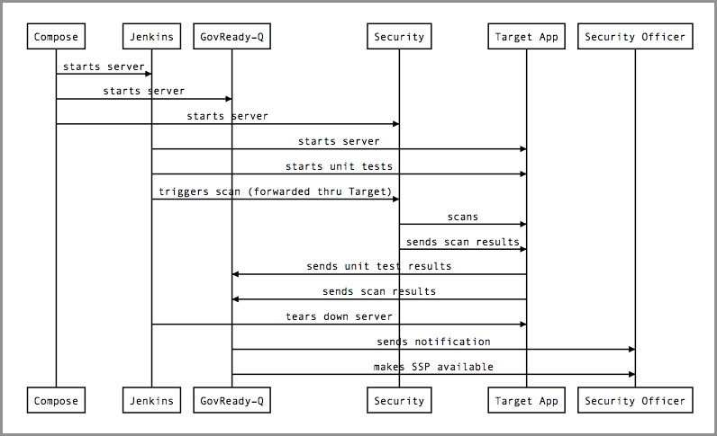

# Try Continuous ATO Kit using Docker Compose

1. [Overview](#overview)
1. [Step 1 - Install Docker](#docker)
1. [Step 2 - Get This Kit](#getkit)
1. [Step 3 - Set Up the Pipeline Environment](#pipeline)
	1. [Step 3(a) - Start the Servers and Network](#network)
	1. [Step 3(b) - Set Up Build Server](#build_server)
	1. [Step 3(c) - Set Up Security Server](#security_server)
	1. [Step 3(d) - Set Up Compliance Server](#compliance_server)
1. [Step 4 - Set Up Build Task](#buildtask)
1. [Step 5 - Build Target App](#build)
1. [Step 6 - View Compliance Artifacts](#view)
1. [Step 7 - Try a Build that Isn't Compliant](#noncompliant)
1. [Step 8 - Tear-down](#teardown)

# <a name="overview"></a> Overview

This proof-of-concept demonstrates how security checks, compliance testing, and compliance artifact maintenance can be just another automated part of the Continuous Integration/Continuous Deployment (CI/CD) pipeline.

In this example, we use `docker-compose` to create a build environment consisting of:

* A **Build Server** running Jenkins
* A **Security Server** running OpenSCAP and nmap
* A **Compliance Server** running [GovReady-Q](https://github.com/GovReady/govready-q)

In a typical build environment, the **Build Server** (Jenkins) uses a Jenkinsfile to spin up a clean **Target App Container** and builds the target application on that container. If application tests pass, the **Target App Container** is moved into a production environment.

In this proof-of-concept:

* We add security testing to the Jenkinsfile: Once the application is built and the tests pass, the Jenkinsfile initiates a scan of the Target App and its operating system performed by the **Security Server**.
* We add compliance to the Jenkinsfile: The test results and other system information, such as the system's hostname, are sent as compliance evidence to the **Compliance Server** (GovReady-Q).
* The **Compliance Server** checks for compliance and updates a System Security Plan for review and approval.
* The **Compliance Server** performs business logic rules to support compliance go-no-go decision-making.

The target application being built in this example is a Python library. But we won't look at the application in this tutorial. We will only be concerned with the security and compliance results.

The complete pipeline environment is:


Our example is simplifed to run on a single workstation playing the role of both the **Docker Host** for the pipeline environment containers and **DevSecOps Workstation**, i.e. your personal computer. Our instructions below refer to the Docker Host and DevSecOps Workstation separately in order to communicate what is happening functionally, even though they are implemented by the same workstation in this demonstration.

The sequence of events in the build is:




# <a name="docker"></a> Step 1 - Install Docker

First [install Docker](https://docs.docker.com/engine/installation/) and Docker Compose on the **Docker Host** (i.e. your personal workstation).

* On Mac and Windows, Docker Compose is included as part of the Docker install.

* On Linux, after installing Docker, [install Docker Compose](https://docs.docker.com/compose/install/#install-compose). Also, you may want to [grant non-root users access to run Docker containers](https://docs.docker.com/engine/installation/linux/linux-postinstall/#manage-docker-as-a-non-root-user).


# <a name="getkit"></a> Step 2 - Get This Kit

Get this Continuous ATO Kit by cloning this repository onto the **Docker Host** (i.e. your personal workstation).

	git clone https://github.com/GovReady/continuous-ato-kit
	cd continuous-ato-kit


# <a name="pipeline"></a> Step 3 - Set Up the Pipeline Environment


## <a name="network"></a> Step 3(a) - Start the Servers and Network

We use Docker Compose to orchestrate the creation of the pipeline environment, consisting of the **Build Server**, the **Security Server**, and the **Compliance Server**. [docker-compose.yml](docker-compose.yml) holds the configuration of the pipeline environment. Run our "up" script to create the pipeline environment:

	./atokit-up.sh

This script uses Docker Compose to build and start the servers. It then shows the live server logs on the console.

Wait for the three servers to say they are each ready:

* When the **Build Server** is up, you will see the message *"INFO: Jenkins is fully up and running"*.
* When the **Security Server** is up, you will see the message *"INFO: Security and Monitoring Server is fully up and running."*
* When the **Compliance Server** is up, you will see the message *"GovReady-Q is fully up and running."*


The pipeline environment now exists. In the next step, we'll set up and configure the software in the pipeline.


## <a name="build_server"></a> Step 3(b) - Set Up Build Server

The **Build Server** is running Jenkins based on the official `jenkinsci/blueocean` image on Docker Hub. It will store persistent data in a Docker volume named `jenkins-data`. It will run on port 8080.

In this step, we will unlock Jenkins, install plugins, and create an administration account.

Since `docker-compose` is still running in the foreground from the previous step, **open a new terminal**. In your new terminal, run the following script to display the Jenkins unlock password created when Jenkins was spun up:

    ./get-jenkins-password.sh

Select and copy the displayed password.

Open a browser and navigate to the Jenkins administration interface at:

	http://localhost:8080/

You should see a page named Unlock Jenkins. Paste the unlock code from the terminal into Jenkins to login.


Choose “Install Suggested Packages”, then “Continue as admin”, then “Start using Jenkins”.

Your Jenkins Build Server is now set up. Next, we'll set up the Security and Monitoring Server.


## <a name="security_server"></a> Step 3(b) - Set Up Security Server

The **Security Server** has been built by Docker Compose using our [security-server Dockerfile](security-server/Dockerfile). It is based on the official CentOS 7 image from Docker Hub and is automatically set up with OpenSCAP and nmap and is ready to run during the build process. There is nothing further than needs to be done to set up the Security Server.

Next, we'll set up the Compliance Server.


## <a name="compliance_server"></a> Step 3(c) -  Set Up Compliance Server

The **Compliance Server** is running GovReady-Q based on GovReady's official nightly image on the Docker Hub. It is now running on port 8000.

Our [compliance-server Dockerfile](compliance-server/Dockerfile) extends the official image with a script to create a default user and organization and start a Compliance App automatically, which saves a few steps in this proof-of-concept tutorial. You will run the script below.


### Setting up Compliance Server Networking

The GovReady-Q compliance server has security protections that do not permit it to be accessed at the `localhost` address. It must be accessed using its actual hostname on the network. In this example, its hostname on the Docker network is `govready-q`.

Add an alias entry for GovReady-Q to your workstation's `/etc/hosts` file, which will permit you to enter `http://govready-q` in your web browser to reach a server on your own machine. Open `/etc/hosts` as your workstation's superuser and at the end add:

	127.0.0.1	govready-q

*(Note: If your workstation is not the same as the **Docker Host**, use the IP address of the Docker Host.)*


### Setting up GovReady-Q

Back on a terminal on the **Docker Host**, run the following command to execute the script mentioned earlier which will create an administrative account on GovReady-Q, install the correct Compliance App to display the compliance of our target application, and provide credentials that you will add to Jenkins:

	docker-compose exec govready-q ./first_run.py

A new administrative user will be created on the GovReady-Q Compliance Server. The username and password and other information will be written to the console:

	Creating administrative user...
	Username: demo
	Password: 9kAxaPW6hJVLsscf5jbWn6vc
	API Key: bdAq16aGh0ybzMAWMioCyWqpb2wItlYo
	Creating default organization...
	Adding TACR Demo Apps...
	Starting compliance app...
	...
	API URL: http://govready-q:8000/api/v1/organizations/main/projects/4/answers

Now open the GovReady-Q Compliance Server in a web browser at:

	http://govready-q:8000

Log into GovReady-Q using the credentials on the console.

View the Compliance App by clicking “Target App” and then “TACR SSP All”. This app will collect system information, non-technical controls, and other information necessary to produce a System Security Plan (SSP). At the end of the Jenkins build, the SSP in GovReady-Q will include system information and evidence automatically collected and/or generated during the build.


# <a name="buildtask"></a> Step 4 - Set up Build Task


## Provide Security and Compliance Server Credentials to Jenkins

The Jenkins build will collect and generate compliance evidence that will be stored on the **Compliance Server**. Additionally, the **Security Server** will scan the target application by running OpenSCAP on the **Target App Container** over SSH. Jenkins will therefore need write-access credentials to the Compliance App on GovReady-Q that will hold the evidence collected and generated during builds, and the **Security Server** will need login access to the **Target App Container**. These credentials will be managed by the Jenkins Credentials plugin.

### Add Compliance Server credentials

In Jenkins, go to the top level of Jenkins, and then to the Credentials page.

Click on the global credentials scope. Click on “Add credentials”. Change “Kind” to “Secret text”. 

For the “Secret”, paste the API URL found in the GovReady-Q console output from the last step. For “ID”, enter `govready_q_api_url`. Optionally add a description. And click “OK”.


Add a second “Secret text” credential in the same manner where the “Secret” is the GovReady-Q API Key found in the console output earlier and the “ID” is `govready_q_api_key`.

Once the credentials have been set, they will look like this:


### Add Security Server credentials

Add a third credential whose kind is “Secret file”. Browse to [security-server/keys/id_ecdsa.pub](security-server/keys/id_ecdsa.pub) in this repository to select it. Set the credential ID to `target_ecdsa.pub`. This file is part of a pre-generated, unsafe public-private keypair that should only be used in a throw-away environment like this one.

In the next step, we will set up the build task in Jenkins. Then we will be ready to run our build and watch our Security Server scan our target app and update compliance artifacts in our GovReady-Q Compliance Server.


## Create the Jenkins Pipeline

This tutorial will build [the Jenkinsfile in this repository](Jenkinsfile), as if it were the target application's Jenkinsfile. We will have Jenkins pull the code in this repository directly from GitHub. (You can certainly also build from a local repository, but because Jenkins is running in a virtualized container access to the host machine's filesystem is limited in this setup.)

* Start at the Jenkins dashboard, at http://localhost:8080/

* Click on “New Item”.

* Enter an item name, such as “Continuous ATO Kit”.

* Click “Pipeline” as the type of project, then click “OK” at the bottom of the screen.

* Now, to configure the project, click the “Pipeline” tab to scroll down to the Pipeline section.

* For “Definition”, choose “Pipeline script from SCM”.  This will tell Jenkins to look in a repository for a Jenkinsfile to use as the pipeline script.

* For “SCM”, choose “Git”.  Then for “Repository URL”, enter the URL for the repository, which is `https://github.com/GovReady/continuous-ato-kit`.

* You can leave “Credentials” set to “none”.  (*Advanced*. For a private repository, you could set up a GitHub personal access token for Jenkins to use, and then provide it to Jenkins here.)

* Click “Save”, and you’re ready to build.


# <a name="build"></a> Step 5 - Build Target App

You should now be on a page on Jenkins named Pipeline Continuous ATO Kit. If not, return to the top level of Jenkins, then in the list of projects open the Continuous ATO Kit pipeline project.

Click “Open in Blue Ocean”. Then click “Run” to start the build.


When the build appears in the build listing table, click it to open its live status page. It will run the stages of the build:


The Jenkinsfile has three typical stages: OS Setup, Build, and Test. This tutorial's Jenkinsfile adds a Compliance stage. During the compliance stage of the Jenkinsfile:

* The **Security Server** runs an OpenSCAP scan of the **Target App Container** and saves the scan report to disk.
* The **Security Server** performs an nmap port scan of the **Target App Container** and the results of the scan are saved to disk. (Actually, due to network constraints in this tutorial's pipeline environment, in this demo the scan is performed of the Build Server.)
* The hostname of the **Target App Container** is collected as additional compliance evidence.
* The hostname and the security and port scan results are sent to GovReady-Q on the **Compliance Server** using GovReady-Q's API.

This build produces a compliant system. The end of the build shows:


# <a name="view"></a> Step 6 - View Compliance Artifacts

Now return to GovReady-Q in your browser at. You should be already logged in and looking at the TACR SSP All  Compliance App--- if not, see the instructions earlier for getting the credentials on the console.

Click “Review” to inspect the information uploaded to the compliance server during the build:


Go back, then click “SSP Preview” at the bottom of the page. Scroll down to `CM-6: Configuration Settings`. You will see that:

* The hostname of the build container was collected during the build and appears in the System Security Plan.

* The OpenSCAP report is included in the System Security Plan as a thumbnail with a link to download the report.

* The nmap port scan results are included in the System Security Plan.

* Business logic rules have been applied to the scan results and the system is indicated as passing compliance checks.


# <a name="noncompliant"></a> Step 7 - Try a Build that Isn't Compliant

You will go back to [Step 5 - Build Target App](#build), but first, queue up this command in a new terminal.  Do not press ENTER yet, though.

```
docker exec -it target-app-server python -m SimpleHTTPServer 21 >/dev/null
```

This command will simulate an open FTP port, which represents a security risk that will be caught during the port scan.  When the command is ready to go, proceed again with [Step 5](#build).

A few seconds after the build has started, press ENTER in the terminal to start the simulated FTP server.  If you get an error, "Error: No such container: target-app-server", it means the build hasn't quite started -- just try the command again.

During the Test stage, the port scan will detect the open port, and stop the build with the message "Out Of Compliance".  If you have the GovReady-Q SSP page up in your web browser, you will see an out-of-compliance alert there, too.

When the build ends, the simulated FTP server command will automatically exit.  If you want to kill the FTP server at any other time, you can press CTRL+C on the keyboard, and you'll get your command prompt back.

You can re-run the Jenkins build as many times as you like.  If the simulated FTP server is running, the build will fail with "Out Of Compliance".  If it is not running, it will complete successfully with the "Compliant" message.

# <a name="teardown"></a> Step 8 - Tear-down

Kill the atokit-up script running in the first terminal by pressing CTRL+C on the keyboard.

Remove the containers, the network, and the persistent data volume for Jenkins started by docker-compose:

	./atokit-down.sh

There are official base images for GovReady-Q, Jenkins, and CentOS 7 that were pulled down to support the builds, which you may want to keep installed within Docker.  Or if you prefer to remove them to save disk space, you can run:

	./atokit-rm.sh
